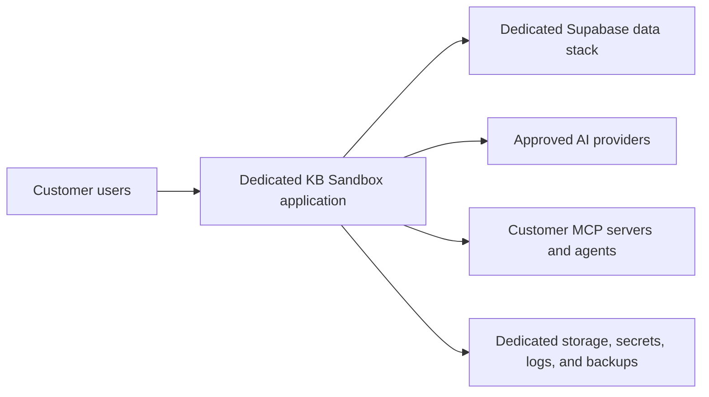

# ADR-0001: Dedicated-Instance-First Deployment with a SaaS-Ready Architecture

**Status:** Accepted  
**Decision date:** 22 August 2026  
**Owners:** KB Sandbox product and architecture  
**Scope:** Commercial deployment, customer isolation, product configuration, and future hosting models

## Decision

KB Sandbox will initially be delivered as a **dedicated instance for each customer**, either managed by KB Sandbox or deployed within the customer's environment.

All customer instances will use the same versioned KB Sandbox product, database schema, migration process, and configuration model. Customer-specific source-code forks are not part of the normal product model.

The architecture will retain explicit organisation boundaries and avoid assumptions that would prevent a future shared multi-tenant SaaS edition. A shared production database and application runtime will not, however, be the initial enterprise deployment model.

This decision can be summarized as:

> One product with multiple deployment modes; dedicated customer instances first, with a SaaS-ready architecture underneath.

## Context

KB Sandbox stores and processes information that may be particularly sensitive to an enterprise customer, including:

- architecture evidence and assessments;
- source-derived technical knowledge;
- project notes, artifacts, and governance decisions;
- AI conversations and user context history;
- model, prompt, and evaluation provenance;
- registered agents, MCP connections, and execution traces;
- organisation-specific policies and knowledge.

Enterprise and regulated customers may require control over their database, file storage, encryption boundary, secrets, AI-provider credentials, backups, retention policy, network access, and deployment region. Some customers may require deployment in their own Azure or AWS account, private cloud, or local infrastructure.

A shared SaaS service may eventually provide lower operating cost and simpler onboarding for smaller organisations. At the present stage, the security, privacy, operational, and contractual consequences of strict multi-tenant isolation would add considerable risk and engineering complexity.

## Decision drivers

- Strong isolation of customer data and configuration.
- Customer trust in a product intended to support governance and assurance.
- Support for regulated, sovereign, regional, or private-cloud requirements.
- Independent AI-provider credentials and data-processing choices.
- Clear backup, restoration, export, retention, and offboarding boundaries.
- Ability to deploy on Vercel, Azure, AWS, or customer-controlled infrastructure.
- Avoidance of customer-specific product forks.
- Preservation of a credible future path to shared SaaS.
- Manageable implementation risk during early commercial adoption.

## Considered options

### Option 1: Shared multi-tenant SaaS from the outset

All customers share an application service and supporting data platform, with logical tenant isolation enforced through organisation identifiers, authorization, and database policies.

**Advantages**

- Lowest infrastructure cost per customer at scale.
- Centralised releases and operational monitoring.
- Fast customer provisioning.
- Simple trial and self-service subscription experience.

**Disadvantages**

- Tenant isolation becomes a critical security boundary throughout the application.
- A single authorization or row-level security defect could expose another customer's sensitive governance evidence.
- More complicated regional, retention, encryption, backup, and customer-key requirements.
- Harder to satisfy private-cloud, on-premises, and isolated-network requirements.
- Requires mature tenant-aware operations, metering, support, incident response, and testing before early customer needs are fully known.

### Option 2: Independently customised product for every customer

Each customer receives a separately modified version or branch of KB Sandbox.

**Advantages**

- Maximum freedom to meet customer-specific requests.
- Strong infrastructure and code-level separation.

**Disadvantages**

- Product forks make upgrades, security patches, migrations, testing, and support progressively harder.
- Customer installations drift and cannot benefit reliably from the shared roadmap.
- Defect fixes may need to be repeated across branches.
- Commercial and operational costs grow faster than the customer base.

This option is rejected as the normal delivery model.

### Option 3: One product with dedicated customer instances

Each customer receives an isolated deployment of the same configurable, versioned KB Sandbox product.

**Advantages**

- Clear application, database, storage, secret, logging, and backup boundaries.
- Supports managed dedicated cloud, customer cloud, and local deployment.
- Customers can use their own AI-provider credentials and network policies.
- Reduces the consequence of an accidental cross-organisation query.
- Preserves a single product roadmap and upgrade path.

**Disadvantages**

- Higher infrastructure and operational cost per customer.
- Upgrades and migrations must be coordinated across multiple installations.
- Requires repeatable provisioning, health monitoring, backup verification, and release automation.
- Fleet management becomes necessary as the customer base grows.

This is the selected option.

## Target deployment modes

| Deployment mode | Isolation | Intended use |
| --- | --- | --- |
| Managed Dedicated Cloud | Separate KB Sandbox application and data stack for each customer | Initial enterprise customers that want a managed service |
| Customer-Hosted | The same product deployed in the customer's Azure, AWS, private cloud, or approved infrastructure | Regulated, sovereign, and larger organisations |
| Shared SaaS | Shared services with rigorously tested logical tenant isolation | Possible future edition for smaller organisations, trials, or lower-cost use |

These modes are editions of one product, not separate customer codebases.

## Logical architecture

Deployment together does not require placing every component in one container. A private deployment may use separate application and Supabase services coordinated through a repeatable container or cloud deployment package.

## Required architectural consequences

### One versioned product

- Customer behaviour must be controlled through configuration, feature policy, permissions, and supported extensions rather than source-code branches.
- Every installation must record its application version, schema version, and relevant deployment configuration version.
- Database and storage migrations must be repeatable, observable, and recoverable across independent installations.

### Organisation-aware domain model

- Organisation identity and ownership must remain explicit even where one deployment initially contains only one customer.
- Projects, users, knowledge, conversations, journals, shared links, agents, MCP connections, artifacts, evaluations, and governance records must be organisation-scoped where applicable.
- Authorization must be enforced in server and data access layers rather than assumed from the dedicated infrastructure boundary.
- Organisation scoping must not be removed merely because the first deployment mode is single-tenant.

This keeps the domain model suitable for organisational separation, managed service operations, test environments, mergers or transfers, and a possible future shared SaaS edition.

### Isolation boundaries

Each dedicated customer instance should have separate or explicitly isolated:

- application runtime;
- PostgreSQL database and authentication data;
- file and artifact storage;
- encryption keys and application secrets;
- AI-provider and integration credentials;
- MCP and agent connection configuration;
- operational logs and trace storage;
- backups and restoration procedures;
- network policy and external service allow-lists.

Central deployment tooling must not receive access to customer content by default. Operational access must be explicit, least-privileged, time-bounded where practical, and auditable.

### Portability

- Application configuration must remain external to the codebase.
- The application should be deployable as a standard container without requiring a Vercel-specific runtime.
- A complete private deployment may package KB Sandbox with a self-hosted Supabase stack while retaining clear service boundaries.
- External AI services must be configurable so a customer can select approved providers or compatible private models.
- Backup, restore, export, import, retention, and offboarding procedures must be designed and tested.

### Fleet operations

Before supporting a substantial number of dedicated installations, KB Sandbox will need:

- repeatable provisioning and configuration validation;
- automated upgrade and migration orchestration;
- health and version monitoring that does not collect customer content;
- backup and restoration verification;
- vulnerability and patch reporting;
- documented support-access controls;
- staged releases and rollback procedures;
- customer-visible maintenance and version information.

A central control plane may be introduced later, but it should manage deployment metadata and health rather than customer knowledge by default.

## Consequences

### Positive

- Stronger trust and a clearer isolation story for early enterprise customers.
- Flexible support for managed, customer-cloud, and local installations.
- Easier use of customer-owned AI credentials, agents, and MCP services.
- Reduced cross-customer exposure risk compared with an early shared data plane.
- A single product can continue to evolve without maintaining customer forks.
- The architecture can still support a future SaaS edition.

### Negative

- Dedicated infrastructure costs more per customer than shared SaaS.
- Deployments, upgrades, monitoring, backups, and support require fleet automation.
- Customer-hosted environments may upgrade more slowly or restrict operational access.
- Compatibility must be tested across supported deployment targets.
- Usage metering, licensing, and support entitlement must work without assuming a shared runtime.

### Risks

- Dedicated instances could still drift if configuration and upgrades are not controlled.
- The existence of an organisation identifier does not by itself make the product safe for shared multi-tenancy.
- Operational convenience could lead to an overly privileged central control plane.
- Customer-specific requests could create de facto forks if the extension and configuration model is too limited.
- Self-hosted Supabase transfers significant database, storage, upgrade, backup, and recovery responsibility to the operator.

## Future shared SaaS gate

A shared multi-tenant edition must be treated as a separate architectural approval, not enabled simply by placing multiple organisations in the same database.

Before approval, evidence should include:

- complete organisation scoping of applicable records and storage objects;
- reviewed and tested database row-level security policies;
- server-side authorization and object-access tests;
- protection against tenant identifiers supplied or altered by clients;
- tenant-safe search, embeddings, caches, background jobs, logs, traces, analytics, exports, and backups;
- tenant-safe AI context assembly and tool execution;
- rate, quota, and cost isolation;
- administrative support boundaries and audited impersonation, if offered;
- penetration testing focused on cross-tenant access;
- incident response and customer-notification procedures;
- legal, privacy, regional, retention, and subprocessors review;
- demonstrated restore and offboarding procedures for an individual tenant.

Until that evidence exists and a new decision is approved, production enterprise customers should remain on dedicated instances.

## What this decision does not decide

This ADR does not select one permanent cloud vendor. It does not require every customer to self-host, nor does it prevent KB Sandbox from operating managed dedicated environments on Vercel, Azure, AWS, or another approved platform.

It also does not determine commercial pricing, licensing terms, contractual service levels, or which party operates Supabase for each customer. Those choices must align with the isolation and single-product principles established here.

## Review triggers

Review this decision when one or more of the following occurs:

- smaller customers require a materially lower-cost shared service;
- dedicated fleet operations become the dominant delivery cost;
- the organisation-scoping and tenant-isolation evidence meets the future SaaS gate;
- a major customer or regulatory requirement changes the deployment boundary;
- the product replaces or substantially changes its Supabase dependency;
- a central management plane is proposed;
- customer-specific changes begin creating pressure for product forks.

## Related documents

- [KB Sandbox Deployment and Server Options](../Deployment/DeploymentServerOptions.md)
- [Workbench Assistant Agent Flow Visibility](../dev-request-workbench-assistant-agent-flow-visibility.md)
- [Agent Harnesses: Operating and Governing Enterprise AI Agents](../workbench-handbook-agent-harnesses.md)
