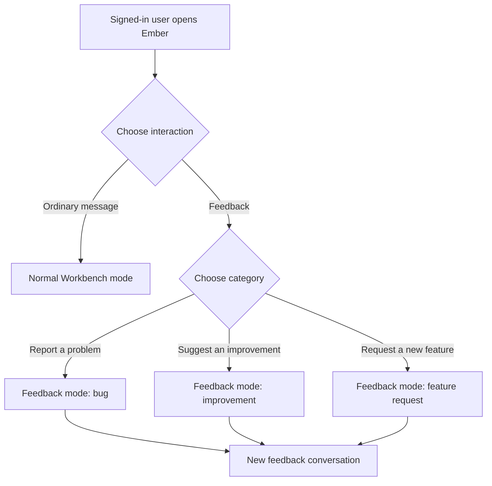
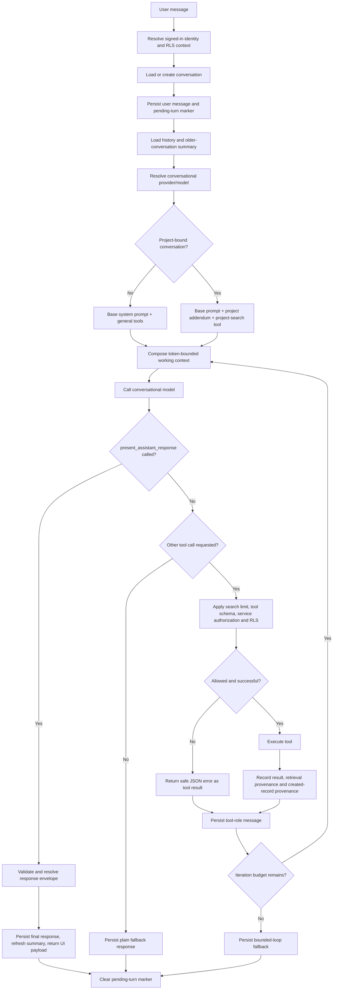
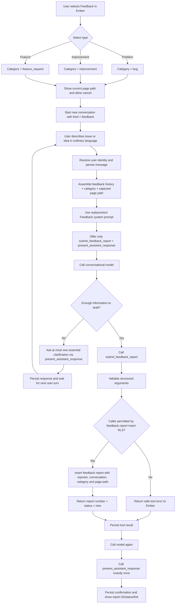
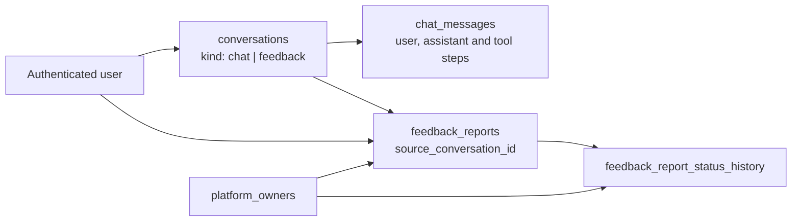

# Ember Agent Graph — Current Runtime and OR-014 Feedback Mode

**Status:** Derived design — current runtime verified from code; feedback branch based on the approved OR-014 Phase 1 plan  
**Derived:** 25 August 2026  
**Current prompt version:** `m7-v6`  
**Primary runtime:** `src/lib/chat/loop.ts` — `runAssistantTurn()`

## Conclusion

Ember is an **agent**: a conversational model operating inside a server-controlled harness that assembles context, offers tools, executes permitted tool calls, persists results and loops until a terminal response is produced.

It is currently a **single agent with one bounded model/tool loop**, not a multi-agent system. The OR-014 plan does not add another agent. It adds a dedicated **Feedback mode** to Ember with a replacement prompt and a reduced tool set.

```text
Ember identity
    └── One conversational agent
          ├── Normal Workbench mode (implemented)
          └── Feedback intake mode (OR-014 Phase 1 target)
```

The graph describes observable orchestration, prompts, tools, persistence and guardrails. It does not expose or attempt to reconstruct hidden model reasoning.

## Mode-selection graph



**Implementation state:** Normal Workbench mode exists. The Feedback category selector, feedback conversation kind and feedback tool are proposed by OR-014 Phase 1 and are not part of the current runtime until that plan is implemented.

## Current Ember graph — as implemented



### Current tool sets

The general MCP-style registry supplies:

- `search_wiki`
- `list_project_notes`
- `create_project`
- `approve_project`
- `create_workstream`
- `attach_workstream_artifact`

The harness adds tools outside the general registry:

- `present_assistant_response` — required terminal structured-response tool;
- `search_project_knowledge` — offered only when the conversation is server-bound to a project.

Project identity is taken from the persisted conversation row, not from a model-provided project identifier. A conversation remains general or bound to its original project.

## OR-014 Feedback-mode graph — target design



### Important interpretation of the clarification branch

`present_assistant_response` remains terminal **for one turn**. If Ember needs clarification, it uses that terminal response to ask the question and then waits for the user's next message. It does not run an invisible interview loop. Across the feedback conversation, Ember should ask no more than one essential follow-up in the normal path.

### Feedback prompt purpose

The Feedback prompt should replace the normal Workbench prompt for this mode and instruct Ember to:

- stay within feedback intake;
- reuse facts already stated in the feedback conversation;
- ask at most one essential clarification;
- prepare a concise structured bug, improvement or feature request;
- call `submit_feedback_report` only when the draft is ready to send;
- never promise acceptance, priority, assignee, delivery date or resolution;
- never search Wiki or project evidence during this phase; and
- confirm the real report number only after the insert tool succeeds.

### Planned feedback tools

| Tool | Role | Terminal? | Server behavior |
|---|---|---:|---|
| `submit_feedback_report` | Creates the structured feedback record | No | Validate with Zod, insert through the caller's RLS-scoped client, return report number and `new` status |
| `present_assistant_response` | Shows clarification or final confirmation | Yes | Validate the response envelope, persist the assistant message and end the current turn |

`submit_feedback_report` must be a normal non-terminal tool. Making it a second terminal tool would conflict with the current loop's single terminal-action design.

## Node responsibility map

| Node/capability | Owned by | Trust boundary |
|---|---|---|
| Feedback category and captured page | Ember client UI | User-visible; page path is informational only |
| Signed-in identity | Authentication/server action | Never supplied by the model |
| Reporter ID | Server context/RLS | Forced to authenticated user |
| Conversation kind | Server conversation service | Separates feedback from ordinary history |
| Feedback prompt and available tools | Ember harness | Server-owned configuration |
| Draft title/description/type fields | Conversational model | Untrusted until schema validation |
| Report insert | Feedback tool + database RLS | KB Sandbox enforced |
| Report status returned to user | Insert result | Must come from real stored record |
| Owner triage decision | Authorized human owner | Ember cannot make this decision |
| Final rendered response | Response envelope resolver | Links/citations resolved and filtered server-side |

## Guardrails

### Current runtime guardrails

- Maximum model/tool-loop iterations per turn: **8**.
- Maximum `search_wiki` calls per turn: **2**; later calls are refused in code.
- `present_assistant_response` is the terminal action; simultaneous additional tool calls are dropped.
- Tool inputs and outputs are schema-validated.
- Tool/service functions and database RLS enforce authorization.
- Project retrieval is available only for a server-resolved project-bound conversation.
- Retrieved citations are retained only when supported by actual current-turn retrieval provenance.
- Created project/workstream/artifact records receive assistant provenance.
- Ember has no repository-writing, commit, pull-request or deployment tool.
- The turn is stopped with a visible fallback when the iteration budget is exhausted.

### OR-014-specific guardrails

- Feedback mode receives only its two dedicated tools; no Wiki/project search or general creation tools.
- Reporter identity, current page and conversation link come from trusted application context, not model arguments.
- Platform `admin` or `curator` status does not grant access to the private owner board.
- The model proposes classification fields but cannot triage, accept, decline, prioritize, assign or resolve the report.
- Phase 1 attaches the current page path only; screenshot/file capture is explicitly deferred by the approved plan.
- The report is not created until the submit tool is called successfully.
- A failed insert must not yield a fabricated report number or success message.
- Normal chat history lists exclude conversations with `kind = feedback`.

## Persistence graph



- `chat_messages` provides the visible feedback interview and tool-call history.
- `feedback_reports` is the operational feedback record, not the conversation itself.
- `feedback_report_status_history` provides owner-only audit history.
- `platform_owners` provides the owner authorization boundary with no platform-role bypass.

## What is derived versus proposed

| Area | State | Source |
|---|---|---|
| Single-agent model/tool loop | Implemented | `src/lib/chat/loop.ts` |
| General tool registry | Implemented | `src/lib/mcp/tools.ts` |
| Project-bound retrieval branch | Implemented | `src/lib/chat/project-knowledge-tool.ts` and conversation project binding |
| Structured terminal response | Implemented | `src/lib/chat/response-envelope.ts` |
| Read-only agent descriptor and flow page | Implemented | `src/lib/workbench/assistant-descriptor.ts`, `/agents/workbench-assistant` |
| Feedback category selector and mode | Proposed | OR-014 Phase 1 plan |
| `conversations.kind = feedback` | Proposed | OR-014 Phase 1 plan |
| Feedback replacement prompt | Proposed | OR-014 Phase 1 plan |
| `submit_feedback_report` tool | Proposed | OR-014 Phase 1 plan |
| Owner feedback board and audit tables | Proposed | OR-014 Phase 1 plan |
| Screenshot/file attachment | Deferred | Explicit Phase 1 decision |
| Duplicate-linking UI and pilot summaries | Deferred | OR-014 follow-up |

## Recommended implementation alignment

When OR-014 is implemented, extend the existing runtime descriptor so `/agents/workbench-assistant` can switch between:

- **Normal Workbench flow — As implemented**; and
- **Feedback intake flow — As implemented**.

Until the feature ships, label the feedback diagram **Planned**, not active. Derive feedback tool schemas and limits from the real runtime definitions after implementation rather than duplicating literals in the visualization.

The resulting visualization should remain read-only. Users may inspect Ember's prompts, tools, guardrails and sanitized run steps according to their permissions, but they must not edit the live agent from the graph.
