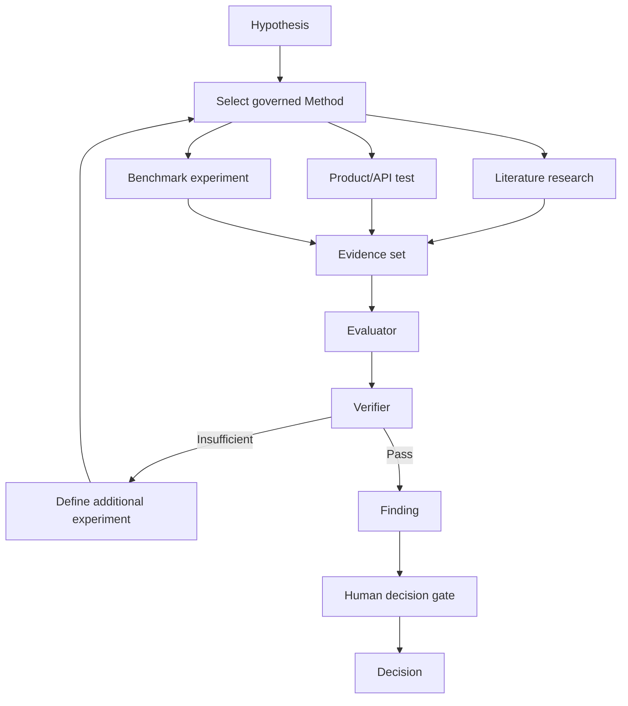
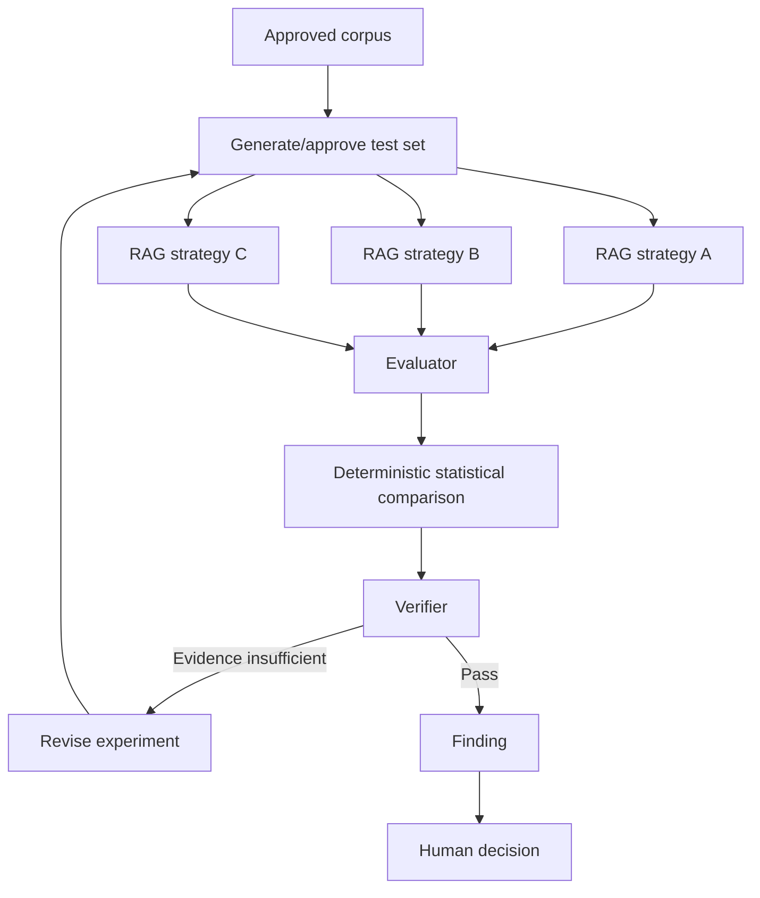
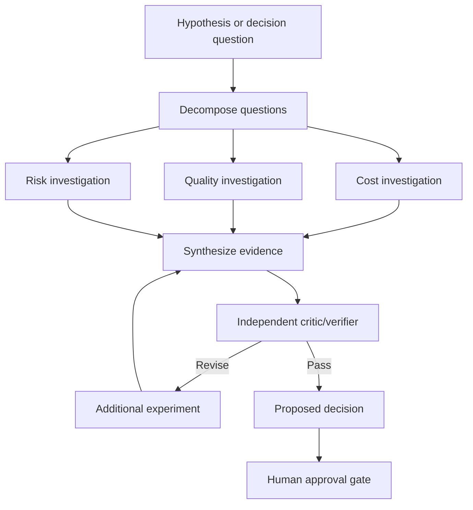

# Graph Engineering and Executable Workbench Methods

**Status:** Architectural direction for post-pilot assessment  
**Recorded:** 25 August 2026  
**Research prompt:** [W. H. Rrari — Substack note](https://substack.com/@whrrari/note/c-319344906?r=3s8sw)  
**Related lifecycle:** Hypothesis → Method → Experiment → Evidence → Evaluation → Finding → Decision

## Architectural principle

> **Conversational on the surface; graph-orchestrated underneath; evidence-driven at the output.**

KB Sandbox should let non-technical users express an objective, question or hypothesis conversationally. The selected Workbench Method may then coordinate model calls, deterministic code, tools, evaluators, verifiers and human gates as a versioned execution graph. The principal user experience remains the evidence and decision—not a node-wiring canvas.

Graphs are an implementation and governance mechanism, not proof that a system is better. KB Sandbox should test whether a proposed graph improves the outcome enough to justify its complexity.

## Two implications for KB Sandbox

### 1. Graph engineering becomes an object of evaluation

An architectural assertion such as “a multi-agent graph will perform better than a single agent for this research task” should become a controlled experiment rather than an accepted assumption.

A useful comparison set is:

| Variant | Execution shape |
|---|---|
| A | Single agent, one bounded loop |
| B | Single agent with iterative critique/revision |
| C | Planner → parallel researchers → synthesizer |
| D | Planner → researchers → independent verifier → synthesizer |
| E | A selected graph using cheaper worker models and a stronger verifier/synthesizer |

Evaluate repeated runs for:

- task quality and evidence coverage;
- factual/citation correctness;
- completion and failure rate;
- variance and reproducibility;
- latency;
- input/output tokens;
- model and infrastructure cost;
- recovery/retry behavior;
- human correction required; and
- operational complexity.

The evaluation question is not “Are graphs better?” It is:

> **For this task, evidence boundary and service target, when is graph engineering worth its additional cost and complexity?**

### 2. Graph engineering may become the execution architecture of Methods

The Workbench lifecycle is naturally graph-shaped:

This should not become one giant prompt. Each node needs a bounded responsibility, explicit inputs and outputs, observable failure behavior and a responsible enforcement boundary.

## Not every node is an agent

Use model nodes only where judgment or interpretation is needed. Prefer deterministic code for validation, calculation, authorization, persistence and state transitions.

| Work | Recommended implementation |
|---|---|
| Formulate or refine a hypothesis | Agent/model with user confirmation |
| Create an experiment record | Deterministic service/database operation |
| Recommend a Method | Agent using governed Method knowledge |
| Validate prerequisites and permissions | Deterministic rules and authorization |
| Execute a fixed experiment configuration | Deterministic runner/tool adapter |
| Evaluate qualitative outputs | Evaluator model with rubric and provenance |
| Calculate latency, cost and statistics | Deterministic code |
| Interpret a body of findings | Agent/model with evidence references |
| Check required evidence exists | Deterministic verifier |
| Approve a consequential decision | Authorized human gate |

This separation reduces model discretion, improves repeatability and makes failures easier to diagnose.

## Workbench Method as a graph template

A future executable Method may include:

- stable Method and version identifiers;
- purpose, scope and boundary;
- required, recommended and optional inputs;
- typed nodes and data-carrying edges;
- node implementation type: agent, deterministic code, tool, evaluator, verifier or human gate;
- explicit input/output schemas;
- source and evidence policies;
- model roles and permitted models;
- tool permissions;
- retry, timeout and termination policies;
- failure and recovery paths;
- state and artifact persistence;
- approval requirements;
- evaluation criteria; and
- required final deliverables.

The graph template should be immutable once approved and executed. Changes create a new Method version so experiment results remain attributable to the graph that produced them.

## Example — RAG Strategy Evaluation

## Example — Architecture Decision

## User experience boundary

The default experience should be conversational:

> “I want to know whether local models could replace our current cloud model.”

KB Sandbox can then:

1. clarify the hypothesis;
2. recommend a suitable Method;
3. show required inputs and governance gaps;
4. instantiate the approved graph template;
5. execute or coordinate the experiment;
6. collect evidence and evaluation results; and
7. present findings and a human decision gate.

The user sees progress, evidence, limitations, costs and decisions. A technical user or reviewer may inspect the read-only graph and sanitized run trace. Graph editing is not the primary experience.

## Relationship to Ember and customer agents

- **Ember** remains a single conversational agent with a bounded tool loop. It can help formulate hypotheses, recommend Methods, explain progress and navigate evidence.
- **Method graphs** coordinate the execution required to answer a governed question. They may contain zero, one or several agent/model nodes.
- **Customer agents** remain externally implemented and registered as versioned, read-only specifications where appropriate.
- **KB Sandbox's harness** controls identity, authorization, Method/version selection, evidence boundaries, execution state, evaluation, trace presentation and human gates within KB Sandbox.

Do not turn Ember itself into a hidden multi-agent graph merely because graph execution exists elsewhere in the product.

## Relationship to an AI-native SDLC

The layers have distinct responsibilities:

| Layer | Governing question |
|---|---|
| KB Sandbox | Should we build or change this, and which approach is justified by evidence? |
| AI-native SDLC | How do we specify, build, test, review and deploy the selected change? |
| Graph engineering | How are the agents, tools, deterministic operations, evidence and human gates reliably coordinated? |

Production observations can return to KB Sandbox as evidence for a new hypothesis, evaluation or decision. Validated intent and implementation handoffs can move from KB Sandbox into the delivery environment without giving KB Sandbox autonomous repository/deployment authority.

## Graph evaluation requirements

Before preferring a more complex graph, compare it with a simpler baseline under the same:

- dataset and task set;
- source/evidence permissions;
- success rubric;
- model versions and parameter policy;
- run count and randomization policy;
- timeout and retry conditions;
- cost calculation; and
- human-review standard.

Record graph version, node/model/tool versions, inputs, outputs, state transitions, retries, failures, evidence references, evaluation results and human decisions. Do not record hidden chain-of-thought.

## When a graph is justified

A graph is more likely to be valuable when work:

- can genuinely run in parallel;
- needs independent or adversarial verification;
- requires durable state across long-running steps;
- has explicit human approval gates;
- must recover selectively from node failure;
- benefits from different models/tools for distinct bounded jobs; or
- needs auditable evidence movement between stages.

A single loop is usually preferable when the task is short, sequential, low consequence, inexpensive to retry and does not benefit from independent verification.

## Architectural guardrails

- Graph complexity must be earned through evaluation evidence.
- Edges carry typed data/artifact references, not merely an instruction to run the next node.
- Deterministic checks remain deterministic.
- Evidence authorization is re-evaluated at retrieval and execution time.
- Derived artifacts inherit applicable evidence restrictions.
- A verifier cannot approve a consequential business decision unless explicitly authorized as a human approval authority—and an AI model is not such an authority.
- Node retries are bounded and visible.
- Failed/partial runs remain intelligible and do not silently become findings.
- Method and graph versions are immutable for completed runs.
- The primary UX is not a Flowise/Langflow-style editor.
- Read-only visualization and export may be offered for inspection and portability.

## Suggested research sequence

1. Model one existing Method as a read-only graph specification without changing its execution.
2. Choose a contained evaluation Method—RAG Strategy Evaluation is the strongest candidate.
3. Implement deterministic graph execution for fixed nodes and state transitions.
4. Add one evaluator-model node and one deterministic verifier.
5. Compare the executable graph against the current simpler workflow across repeated runs.
6. Add parallelism or multiple agents only if the measured result justifies them.
7. Decide whether approved Method graph templates should become a first-class platform object.

This is post-pilot architectural work. It should not delay OR-014, access-control hardening or the initial Sandz pilot.
