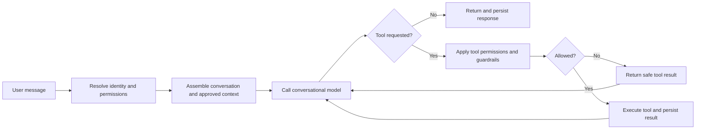

# Development Request: Make the Workbench Assistant Agent Flow Visible

**Status:** Proposed  
**Created:** 21 August 2026  
**Area:** Agents / Workbench Assistant  
**Priority:** Medium — transparency and future agent-design foundation

## Summary

Add a clear, read-only visual view of how the Workbench Assistant and its **agent harness** work. The view should help ordinary users understand what the Assistant can do and help authorised reviewers inspect its model, prompt, context, tools, guardrails, permissions, and completed runs.

The primary home should be the existing **Agents** area at:

`/agents/workbench-assistant`

The chat panel should include a smaller **How this Assistant works** entry point that opens a compact explanation and links to the full Agent page.

The first release must describe the Assistant's real implementation rather than introduce a separately maintained diagram or a general-purpose visual agent builder. Longer term, customer agents will be created and maintained in their own agent environment and registered with KB Sandbox for read-only visualization, governance, publication, and observability.

In this request, an **agent harness** means the controlled operating environment around an agent: identity, prompts, context and memory, model routing, tools, permissions, limits, guardrails, persistence, traces, evaluations, failure handling, and human oversight. The model is only one component of the agent; the harness is what makes its operation governable.

The matching Workbench Handbook source article is [Agent Harnesses: Operating and Governing Enterprise AI Agents](./workbench-handbook-agent-harnesses.md). Use that article as the shared terminology and conceptual reference for this feature. As part of delivery, add it to the `platform_handbook` Wiki category through the normal draft, human-review, and approval lifecycle, using the proposed slug `agent-harnesses-operating-and-governing-enterprise-ai-agents`.

## Why this is needed

As KB Sandbox begins supporting enterprise agents, users need to be able to answer basic governance questions:

- Which model handled this request?
- Which instructions and prompt version governed it?
- Which tools could the Assistant use?
- What permissions and limits applied?
- Which tools were actually used in a particular response?
- Did the run finish, fail, or reach a guardrail?
- Who may change the Assistant, and how would a change be approved?

The existing chat details and provenance are useful but response-specific. They do not provide a coherent view of the Assistant as a governed system.

The visualization is therefore a view into the Assistant's agent harness and observed execution—not a visualization of hidden model reasoning.

## Current implementation to represent

The initial flow must reflect the current Workbench Assistant implementation, which is a single conversational agent with a bounded tool loop. It must not be presented as a multi-agent system.

At the time of this request, the important runtime controls include:

- prompt version: `m7-v5`;
- maximum tool-loop iterations: 8;
- maximum `search_wiki` calls in one turn: 2;
- identity and role resolution before protected operations;
- project and workstream authorisation in the service layer;
- document-first boundary: the Assistant may help produce plans, reviews, assessments, and other governed records, but does not autonomously change source code;
- persisted conversations, messages, tool calls, and provider/model provenance.

These values must be supplied by a server-side Assistant descriptor or runtime configuration. Do not copy them into a second hard-coded UI definition that can silently drift from the real implementation.

## Information architecture

### 1. Full Agent page

Create or adapt `/agents/workbench-assistant` as the authoritative product view for the built-in Assistant.

Design the page to support these eventual sections:

- **Overview** — purpose, status, owner, current version, active model role, and a plain-language explanation;
- **Flow** — visual runtime flow and node details;
- **Runs** — authorised execution history and trace summaries;
- **Prompts & Guardrails** — current governed instructions, tool permissions, and limits;
- **Evaluations** — future quality and safety results;
- **Versions** — registered specification versions, review, approval, and publication history;
- **Exports** — future portable representations.

For the MVP, only **Overview**, **Flow**, and a minimal **Runs** view are required. Other sections may be visibly marked as planned only if that convention fits the existing product; otherwise omit them until implemented.

### 2. Chat entry point

Add **How this Assistant works** to the Assistant header or banner. It should open a compact, read-only panel showing:

- Assistant name and purpose;
- current provider/model used for conversational work;
- active prompt version;
- a plain-language description of the agent harness;
- available tools, expressed in user-friendly language;
- important guardrails and permissions;
- a small flow preview;
- a link to **View full Agent flow**.

This control should not compete with **History** or **Artifacts**. It describes the Assistant itself, not the current conversation's content.

### 3. Response Details link

When a completed response has trace data, its existing **Details** view should include **View this run**. The deep link should open the relevant run on the full Agent page without exposing another user's data.

## Required visual flow

The initial diagram should represent this sequence:



The product may use a suitable native flow component, but the diagram must remain accessible without relying only on colour or animation.

Each node should be selectable and open a details panel. Depending on the node, display:

- plain-language purpose;
- implementation type: model, context, decision, tool, guardrail, or persistence;
- inputs and outputs at a schema or summary level;
- applicable model and prompt version;
- available tools and required permission;
- iteration or search limits;
- failure behaviour;
- provenance or source of the displayed configuration.

## Run trace overlay

For an authorised completed run, allow the same diagram to show the path that was actually taken:

- number and order of model calls;
- tool requested;
- whether the tool was allowed, refused, or failed;
- sanitised tool input and output summaries;
- completion or failure state;
- elapsed time where captured;
- provider, model, and prompt-version snapshots;
- guardrail events, including search or iteration limits.

Use clear states such as **completed**, **active**, **skipped**, **refused**, and **failed**. The run view must distinguish configuration from observed execution.

If current conversation and message records cannot reliably reconstruct this trace, introduce the smallest suitable run/step persistence model. Do not infer a precise historical trace from incomplete data.

## Harness responsibility boundary

The visualization must distinguish responsibility for each harness capability:

- **External execution harness** — the customer's runtime may own model calls, orchestration, prompts, context assembly, tool execution, retries, and operational limits.
- **KB Sandbox governance harness** — KB Sandbox owns registration, specification versions, identity and access within KB Sandbox, evaluation evidence, review, approval, publication, and authorised trace presentation.
- **Shared or reported controls** — some controls are declared by the external agent and observed or evaluated by KB Sandbox but are not directly enforced by KB Sandbox.

Every relevant node or guardrail should identify whether it is **enforced by KB Sandbox**, **enforced externally**, **declared by the owner**, or **observed in run evidence**. Do not imply that KB Sandbox enforces a customer runtime control when it can only record the declaration or evaluate the outcome.

## Prompt and reasoning transparency

Show governed instructions, tool contracts, guardrails, visible model responses, and sanitised tool activity where the user's role permits it.

Do **not** request, store, or display hidden chain-of-thought or private internal reasoning. Where an explanation is useful, show a concise action rationale such as:

> Searched the Workbench Handbook because the user requested a method recommendation.

Prompt visibility may be role-sensitive:

- ordinary users see a plain-language purpose and guardrail summary;
- curators and reviewers may inspect the active prompt and tool definitions;
- administrators may inspect configuration provenance;
- secrets, provider credentials, bearer tokens, cookies, raw authentication data, and private context from other users must never be displayed.

## Permissions and privacy

- All signed-in users may view the Assistant overview and general flow.
- A user may view traces for their own conversations.
- Curator/admin access to other traces must follow an explicit organisational policy and existing privacy rules; do not grant broad access merely because someone is an administrator.
- Project-scoped evidence, notes, and artifacts must retain their existing access controls in trace summaries.
- Sensitive tool arguments and results must be redacted or summarised before display.
- Trace links must use server-side authorisation and must not rely on hidden UI controls for protection.

## Runtime descriptor

Introduce a typed, server-owned descriptor for the built-in Assistant, or an equivalent projection from its real runtime configuration. It should provide enough information to render the Overview and Flow without duplicating operational constants.

Illustrative shape only:

```ts
type AgentDescriptor = {
  id: string
  name: string
  purpose: string
  status: "active" | "inactive"
  promptVersion: string
  modelRole: "conversational"
  nodes: AgentFlowNode[]
  edges: AgentFlowEdge[]
  tools: AgentToolDescriptor[]
  guardrails: AgentGuardrailDescriptor[]
  harnessResponsibilities?: AgentHarnessResponsibility[]
}
```

The actual implementation may use different names. The important constraint is that the descriptor must be generated from, or validated against, the same definitions used by the runtime.

## Registration and governance boundary

The flow is read-only. Do not allow users to edit a prompt, model, tool permission, guardrail, node, or transition directly from the diagram.

Customer agents should be created and maintained outside KB Sandbox using the customer's preferred implementation environment, such as an MCP server, custom code, LangGraph, or Langflow. KB Sandbox should accept a declared, versioned agent specification and act as its governance and observability layer.

Design the Agent area so a later release can support this lifecycle:

1. register an externally implemented agent;
2. submit a versioned Agent Specification;
3. validate the specification and connection metadata;
4. render the specification as a read-only flow;
5. test connectivity and declared capabilities;
6. evaluate the agent;
7. submit it for review;
8. approve or reject the registered version;
9. publish the approved version to permitted KB Sandbox users;
10. receive authorised run telemetry where supported;
11. register a new immutable version when the external implementation changes;
12. withdraw or roll back publication to a previously approved version.

Registration, approval, publication, and withdrawal must be permission-controlled and auditable. Updating a draft registration or importing a new specification must never silently change the currently published version.

The registered specification is a declaration of the external implementation, not proof that the implementation behaves exactly as declared. Connectivity tests, evaluations, signed/versioned metadata, and observed traces should be used to increase confidence and identify drift.

## Customer Agent Specification direction

Define a portable **KB Sandbox Agent Specification** for externally built agents. It should describe, as applicable:

- stable agent identifier, name, purpose, owner, and organisation;
- implementation and specification versions;
- nodes and transitions;
- inputs and outputs;
- model roles and model identifiers;
- prompts, intentionally disclosed prompt text, or governed prompt references;
- tools and MCP capabilities;
- data-source classifications;
- permissions and intended audience;
- guardrails and operating limits;
- harness capabilities and the party responsible for enforcing each one;
- connection or invocation metadata, stored separately from secrets;
- trace and telemetry capabilities;
- evaluation requirements;
- provenance, timestamps, and integrity metadata.

Prompts are not required to be public to every user. The specification must support visibility classifications and prompt references so owners can disclose enough for governance without exposing confidential intellectual property or secrets.

The specification must never contain API keys, bearer tokens, cookies, passwords, or other credentials. Store secrets using the platform's approved secret-management mechanism and expose only a safe configured/not-configured state.

The read-only visualization must be generated from the registered specification. It must show the specification version and whether the view is **declared** or supported by **observed run evidence**.

## Future portability, not MVP scope

For the built-in Workbench Assistant, its runtime remains authoritative and KB Sandbox derives the visualization from that runtime. For customer agents, the externally maintained implementation remains authoritative while KB Sandbox stores the governed registration and immutable specification versions.

A later phase may import or export a versioned Agent Specification using familiar tools and formats, including:

- Mermaid;
- Obsidian Canvas;
- JSON Agent Specification;
- trace JSON;
- PNG, SVG, or PDF;
- LangGraph/LangChain metadata where a faithful mapping is possible;
- Langflow-compatible JSON where a faithful mapping is possible.

Imports and exports must identify unsupported, unverified, or lossy mappings. KB Sandbox should not attempt to edit or regenerate the customer's implementation from its read-only diagram.

## User experience requirements

- Use plain language first, with technical detail available progressively.
- Clearly label the view as **How the Assistant works** rather than implying that users are seeing private reasoning.
- Provide a text/list alternative to the visual diagram for keyboard and screen-reader users.
- Support keyboard selection of nodes and visible focus states.
- Do not rely solely on colour to indicate run state.
- On smaller screens, allow the flow to pan/zoom or switch to a vertical step view.
- Include an **As implemented** or **Active version** indicator so users can distinguish the live flow from future design material.

## Acceptance criteria

1. A signed-in user can open **How this Assistant works** from the chat panel.
2. The compact view identifies the actual active conversational provider/model and prompt version.
3. The compact view links to `/agents/workbench-assistant`.
4. The Agent page represents the actual single-agent tool loop and does not describe multiple collaborating agents.
5. The active iteration and Wiki-search limits are obtained from the runtime descriptor or shared configuration, not separately hard-coded in the UI.
6. Selecting a flow node shows its purpose, inputs/outputs summary, guardrails, and relevant permissions.
7. A user can open a completed run belonging to them and see the observed path, model/tool sequence, terminal state, and sanitised activity.
8. A user cannot access another user's private run by changing a URL or identifier.
9. Tool inputs/results and prompts do not reveal secrets, authentication data, or inaccessible project content.
10. No hidden chain-of-thought is requested, persisted, or shown.
11. The flow identifies relevant harness capabilities and distinguishes controls enforced by KB Sandbox from controls enforced or merely declared externally.
12. The flow does not permit direct editing of the active Assistant or a registered customer agent.
13. Existing Assistant conversations, tool execution, History, Artifacts, and response Details continue to work.
14. Automated tests cover descriptor accuracy, harness-responsibility labels, run authorisation, redaction, empty/failed traces, and deep-link behaviour.
15. Type checking, linting, and the full automated test suite pass.

## Suggested delivery sequence

### Phase 1 — Read-only Assistant definition

- Add the server-owned Assistant descriptor.
- Add the Overview and Flow UI in the existing Agents area.
- Add the compact chat entry point.
- Add accessibility and privacy-safe node details.
- Add the matching Agent Harnesses article to the Workbench Handbook as a draft for human review and approval.

### Phase 2 — Observed runs

- Persist any missing run/step metadata.
- Add run list and trace overlay.
- Deep-link from response Details.
- Add redaction and authorisation tests.

### Phase 3 — External agent registration and publication

- Define and version the KB Sandbox Agent Specification.
- Register externally implemented agents and their connection metadata.
- Validate specifications and declared MCP or API capabilities.
- Add read-only visualization, evaluation, review, approval, and publication.
- Accept privacy-safe run telemetry where supported.
- Detect and communicate specification/runtime drift where evidence permits.

### Phase 4 — Interchange

- Add Mermaid and Obsidian Canvas export first.
- Add supported Agent Specification imports.
- Add LangGraph or Langflow interchange only after stable internal semantics exist.

## Out of scope for this request

- converting the current Assistant into a multi-agent system;
- arbitrary drag-and-drop agent creation;
- editing customer agent flows or production agent configuration in KB Sandbox;
- autonomous source-code changes;
- exposing hidden model reasoning;
- executing untrusted Langflow, LangChain, MCP, or custom agent definitions inside KB Sandbox;
- automatically treating a declared specification as verified implementation behaviour;
- broad administrator access to private user conversations.

## Product direction

This feature should establish the visual and governance vocabulary that future enterprise agents can reuse. Built-in agents can live under `/agents/{agent}`. Future organisation- or project-specific registrations may use the same Agent catalogue with ownership and scope metadata, with project views linking to the registered agent where appropriate.

Customers build their agents in their preferred environment and expose a controlled interface such as MCP or an approved API. KB Sandbox registers each version, visualizes its declared flow without editing it, evaluates it, governs publication, and displays authorised execution evidence when telemetry is available.

KB Sandbox should be described as providing a **governance harness** around registered agents, not necessarily their complete execution harness. The Workbench Assistant is the first example where both the application and much of the execution harness are visible within the same product.

Use **Agent** for the governed user-facing capability and **Flow** for its implementation view. This keeps the interface understandable while leaving room for more sophisticated orchestration later.
