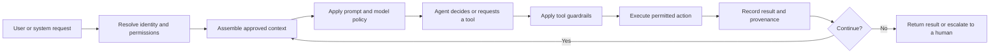

# Agent Harnesses: Operating and Governing Enterprise AI Agents

**Proposed Wiki category:** Workbench Handbook (`platform_handbook`)  
**Proposed slug:** `agent-harnesses-operating-and-governing-enterprise-ai-agents`  
**Proposed status:** Draft → human review → approved  
**Audience:** Enterprise architects, agent owners, reviewers, risk and governance teams, and delivery teams

## Overview

An AI agent is more than a model and a prompt. To operate reliably in an enterprise, it needs a controlled environment that supplies context, grants access to tools, applies permissions and limits, records what happened, handles failures, and supports human oversight. This surrounding environment is commonly called an **agent harness**.

The harness turns an AI capability into an operable and governable service. It does not guarantee that every answer will be correct, but it makes the agent's intended behaviour, operating boundaries, and execution evidence visible enough to test, review, and improve.

## Agent, model, workflow, and harness

These terms describe different parts of the system:

- **Model:** Generates or interprets content. A model does not independently provide organisational identity, permissions, tools, persistence, or approval controls.
- **Agent:** Pursues a defined goal by combining a model with instructions, context, tools, decisions, and iteration.
- **Workflow:** Defines a known sequence of activities, decisions, and handoffs. A workflow may contain one or more agents and non-AI steps.
- **Agent harness:** Provides the operating and governance controls around the agent, including identity, context, tools, guardrails, traces, evaluations, and failure handling.

A useful shorthand is:

> The model supplies intelligence; the agent applies it toward a goal; the workflow organizes the work; the harness makes the operation controlled and observable.

## Typical agent-harness flow

This diagram represents visible system activity. It should not be interpreted as access to a model's hidden chain-of-thought.

## Core harness capabilities

### Identity and access

The harness establishes who or what initiated a request and what that identity may access. Authorisation must be enforced when data is retrieved and when a tool performs an action—not merely described in a prompt.

### Prompt and configuration management

System instructions, tool definitions, model roles, and operating limits should be versioned. A completed run should retain a snapshot or durable reference to the configuration that governed it.

### Context and memory

The harness selects which conversation history, approved organisational knowledge, project evidence, user preferences, and short- or long-term memory may be supplied to the agent. Context should be relevant, permission-scoped, provenance-aware, and bounded to avoid unnecessary disclosure or cost.

### Model routing

Different tasks may require different model capabilities. The harness may route conversational work, structured extraction, embeddings, evaluation, or sensitive processing to approved models while recording the provider and model actually used.

### Tools and MCP capabilities

Tools allow agents to retrieve information or perform controlled actions. Model Context Protocol (MCP) can provide a consistent way to expose those capabilities. The harness should define each tool's purpose, input and output contract, permissions, timeouts, side effects, and audit requirements.

MCP provides an interface; it does not by itself provide complete governance. Authentication, authorisation, validation, approvals, isolation, and monitoring remain necessary.

### Guardrails and operating limits

Guardrails can restrict tools, data sources, iterations, spending, duration, output formats, or prohibited actions. Some controls are deterministic and enforceable in code; others are policy instructions or evaluation criteria. The distinction should be explicit.

### Persistence and provenance

The harness records conversations, tool activity, artifacts, configuration versions, model identity, timestamps, and relevant approvals. Records should be sufficient to support review without retaining unnecessary sensitive information.

### Tracing and observability

An execution trace can show model calls, tool requests, allowed or refused actions, sanitised inputs and outputs, timings, failures, and guardrail events. Tracing should expose meaningful system actions, not hidden chain-of-thought.

### Evaluation and assurance

Agents should be evaluated against their intended purpose, representative scenarios, safety expectations, access boundaries, failure modes, and quality thresholds. Evaluation evidence should be attached to the version that was tested.

### Failure handling and human oversight

The harness should define what happens when a provider times out, a tool fails, evidence is insufficient, a guardrail refuses an action, or the agent reaches an iteration limit. Higher-risk decisions may require explicit human review or approval rather than autonomous completion.

## Build-time and runtime governance

Agent governance operates at two connected stages.

**Build-time governance** includes:

- documented purpose and owner;
- intended users and data classifications;
- versioned specifications and prompts;
- tool and permission review;
- threat and failure analysis;
- representative evaluations;
- approval before publication.

**Runtime governance** includes:

- identity and authorisation;
- model and tool enforcement;
- context boundaries;
- rate, cost, time, and iteration limits;
- traces and operational monitoring;
- incident handling and human escalation;
- withdrawal or rollback when required.

Passing a build-time review does not remove the need for runtime controls and monitoring.

## External agents and shared responsibility

An enterprise agent may be built and run outside the platform that catalogues or governs it. For example, a team might implement an agent as an MCP server, a custom service, or a LangGraph or Langflow application, then register it with an AI governance workbench.

In that arrangement, harness responsibilities are shared:

- The **external execution harness** may control orchestration, prompts, context assembly, model calls, tool execution, retries, and operational limits.
- The **governance workbench** may control registration, version records, evaluations, review, approval, publication, user access within the workbench, and presentation of authorised traces.
- Some behaviours are only **declared by the agent owner** unless supported by evaluation or observed execution evidence.

The governance view should state who enforces each control. It should not imply that a registered declaration proves the external implementation behaves exactly as described.

## Declared flow and observed execution

A visual agent flow may represent two different kinds of evidence:

- **Declared flow:** What the owner or registered specification says the agent is designed to do.
- **Observed execution:** What a recorded run shows the agent actually did.

Both are valuable, but they should never be confused. Comparing them helps identify implementation drift, missing telemetry, unexpected tool use, or outdated documentation.

## Prompts and confidential information

Governance does not always require publishing full prompt text to every user. An agent record may expose a plain-language purpose, prompt version, owner, approval status, and controlled prompt reference while limiting the full text to authorised reviewers.

Agent specifications and traces must not expose API keys, tokens, passwords, cookies, private user context, or inaccessible project evidence. Secrets should remain in an approved secret-management system.

## Minimum evidence before publishing an enterprise agent

The evidence should be proportionate to risk. A practical minimum includes:

1. named purpose, owner, and intended users;
2. versioned agent specification;
3. declared models, tools, data sources, and permissions;
4. identified harness responsibilities;
5. documented guardrails and failure behaviour;
6. representative functional and access-control evaluations;
7. privacy and security review appropriate to the data involved;
8. human escalation and withdrawal process;
9. approval record for the published version;
10. trace or monitoring plan where the runtime supports it.

## Applying the concept in KB Sandbox

The built-in Workbench Assistant can be represented using a runtime-derived, read-only view of its prompt version, model role, context assembly, tools, permissions, guardrails, persistence, and completed runs.

Customer agents can be built in their preferred environment and registered through a versioned Agent Specification. KB Sandbox can then provide a governance harness by:

- cataloguing the agent and its owner;
- visualizing the declared flow without editing it;
- recording immutable specification versions;
- evaluating declared capabilities and controls;
- supporting review, approval, and publication;
- exposing the approved agent to permitted users;
- displaying privacy-safe run evidence when supplied;
- distinguishing externally enforced controls from controls enforced by KB Sandbox.

KB Sandbox is not necessarily the complete execution harness for an external agent. Its governance record should make that boundary visible.

## Questions for an agent review

- What goal is the agent authorised to pursue?
- Who owns it and who may use it?
- Which harness runs it, and which platform governs it?
- What data can enter its context or memory?
- Which models and tools can it use?
- Which controls are enforced in code, and which are only declared?
- What evidence supports the declared flow?
- What happens when a tool, model, or guardrail fails?
- Which actions require human approval?
- Can a reviewer connect a run to its specification, model, prompt, tools, and artifacts?
- How can the agent be withdrawn or rolled back?

## Boundary

An agent harness improves control, transparency, and evidence. It does not eliminate model uncertainty, guarantee correctness, replace security engineering, or transfer responsibility away from the organisation operating the agent. Controls and evidence should be scaled to the consequence of failure.

## Related Workbench concepts

- [Enterprise AI Ontologies: Giving Agents a Governed World Model](./workbench-handbook-enterprise-ai-ontologies.md)
- Agent registration and versioning
- MCP tools and external capabilities
- Model identity and provenance
- Context and memory management
- Evaluations and assessments
- Guardrails and human approval
- Artifacts and evidence
- Architecture governance and compliance
