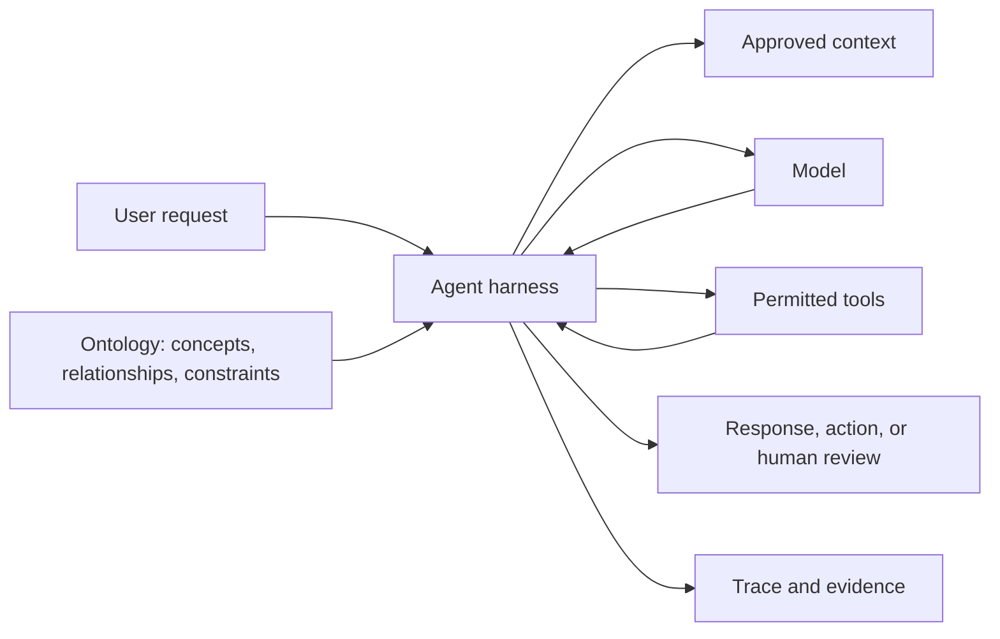

# Enterprise AI Ontologies: Giving Agents a Governed World Model

**Proposed Wiki category:** Workbench Handbook (`platform_handbook`)  
**Proposed slug:** `enterprise-ai-ontologies-governed-world-model`  
**Proposed status:** Draft → human review → approved  
**Audience:** Enterprise architects, knowledge engineers, AI-agent owners, data stewards, reviewers, and governance teams

## Overview

Large language models are effective at recognising and generating patterns in language, but an enterprise does not operate on plausible language alone. It operates through defined concepts, relationships, rules, permissions, responsibilities, and consequences.

An **ontology** is a structured, machine-readable model of the kinds of things that exist in a domain, what they mean, how they relate, and which constraints apply to them. It gives people and systems a shared semantic contract.

For example, an enterprise may define concepts such as:

- Customer
- Project
- Workstream
- Evidence
- Artifact
- Assessment
- Agent
- Model
- Approval

The ontology does more than list these words. It distinguishes one concept from another and defines relationships such as:

- a Project contains Workstreams;
- a Workstream produces Artifacts;
- an Artifact supports a Finding;
- an Assessment evaluates a defined subject;
- an Agent uses Models and Tools;
- an Approval is granted by an authorised identity;
- published Knowledge is based on reviewed sources and versions.

This structure helps an AI system reason within an organisation's declared world instead of relying entirely on whatever relationship between words appears statistically likely.

## Ontology, taxonomy, schema, and knowledge graph

These concepts overlap, but they are not interchangeable.

### Taxonomy

A taxonomy organises concepts into categories or a hierarchy. For example, an Artifact may be classified as Evidence, Findings, a Design Note, or an Implementation Handoff.

A taxonomy answers questions such as:

> What category does this belong to?

### Data schema

A data schema defines how information is stored: tables, fields, data types, required values, keys, and constraints.

A schema answers questions such as:

> Which fields and relationships can the application persist?

A schema can encode part of an ontology, but a database structure is not automatically a complete semantic model. A table name or foreign key may not explain the business meaning, permitted use, lifecycle, or relationship to other concepts.

### Knowledge graph

A knowledge graph stores facts as entities and relationships. For example:

> Artifact A supports Assessment B.

A graph can store many facts without defining their full meaning. The ontology supplies the semantic rules that explain what an Artifact, Assessment, and `supports` relationship mean and which combinations are valid.

A useful distinction is:

> A knowledge graph records connected facts; an ontology defines the meaning and constraints of those facts.

### Ontology

An ontology combines shared concepts, definitions, relationship types, and constraints into a coherent domain model. It can support validation, interoperability, discovery, reasoning, governance, and more consistent AI behaviour.

An ontology answers questions such as:

> What exists in this domain, what does it mean, how may it relate, and what rules must remain true?

## Why ontologies matter for enterprise AI

### Grounding language in domain meaning

The same word can mean different things across teams. “Owner,” “approved,” “source,” “model,” and “project” may each carry operational consequences. An ontology provides declared meanings that can be retrieved, validated, and governed.

### Keeping agents within valid relationships

As AI moves from producing text to proposing or performing actions, it must understand more than labels. It needs to know, for example, that:

- only an authorised role can approve a governed record;
- a draft is not the same as an approved version;
- a citation is not automatically an Artifact;
- a navigation link is not evidence;
- an Agent declaration is not proof of observed runtime behaviour;
- private user context must not become organisation knowledge without an authorised process.

These constraints should be enforced in application and data controls where possible. A prompt statement alone is not an enforceable ontology.

### Reducing semantic drift

Without governed definitions, teams and AI systems may gradually use the same term in incompatible ways. Metrics, retrieval, automation, and reports can then appear consistent while referring to different concepts.

Versioned definitions and relationship rules make semantic changes reviewable rather than invisible.

### Improving retrieval and context selection

Vector search finds semantically similar text. Ontology-aware retrieval can add another dimension: retrieving information because its entity type, lifecycle state, evidence relationship, project scope, or governance status makes it relevant.

The two approaches are complementary. Embeddings help find conceptually related language; ontological structure helps determine which relationships and constraints should govern its use.

### Supporting explainable governance

An AI response becomes easier to review when a system can explain:

- which entity or record it refers to;
- which definition and version applied;
- how the information is related;
- which rule allowed or refused an action;
- which source or Artifact supports a conclusion;
- which person or system approved the relevant state.

This is practical explainability at the system-action level. It does not require exposing a model's hidden chain-of-thought.

## Ontology and the agent harness

The ontology and the agent harness play different but connected roles.

- The **ontology** defines the world the agent is expected to understand: concepts, meanings, relationships, states, and constraints.
- The **agent harness** controls how the agent operates in that world: identity, prompts, context, models, tools, permissions, limits, traces, evaluations, and human oversight.

The ontology helps the harness determine what a request refers to and which relationships should remain valid. The harness enforces the permissions and operational controls that a semantic definition alone cannot enforce.

## What KB Sandbox currently provides

KB Sandbox already contains several **ontology-supporting foundations**. These are useful building blocks, but they do not yet constitute a complete formal enterprise ontology.

### Defined platform concepts

The product distinguishes concepts including:

- organisations and users;
- roles and project membership;
- Knowledge Bases, sources, chunks, Wiki articles, and article versions;
- Projects and Workstreams;
- Artifacts and artifact types;
- assessments, evaluations, findings, and review states;
- agents, tools, models, prompts, and run provenance;
- conversations, messages, citations, navigation, and personal journals;
- draft, review, approved, published, completed, archived, and other lifecycle states.

These concepts are represented through application types, relational tables, validation rules, and user-interface language.

### Explicit relationships

The relational data model records relationships such as:

- projects to members and workstreams;
- workstreams to artifacts;
- Wiki articles to sources and versions;
- conversations to users and messages;
- responses to provider/model provenance;
- agents to models, prompts, tools, and evaluations;
- records to creators, reviewers, and approvals.

The Wiki also supports a simple `related` article relationship. This is a directional database self-join rendered symmetrically; it is deliberately not a graph database or a formal typed semantic graph.

### Controlled vocabularies and lifecycle states

KB Sandbox uses categories, artifact types, project types, statuses, model roles, and other controlled values. These vocabularies reduce ambiguity and support validation.

### Enforced constraints

Some domain rules are enforced through:

- database constraints;
- foreign keys;
- row-level security;
- server-side role and ownership checks;
- service-layer validation;
- version and approval lifecycles;
- typed tool contracts;
- agent-loop limits and guardrails.

These controls are stronger than relying on the Assistant to remember a rule from a prompt.

### Provenance and evidence

The platform records sources, versions, provider/model identity, timestamps, user ownership, reviews, artifacts, and selected AI-operation details. This helps connect a statement or action to the evidence and configuration behind it.

### Human-governed knowledge

Wiki content and other governed records use draft, review, approval, or publication boundaries. This supports the distinction between proposed knowledge and approved knowledge.

## Current capability assessment

| Ontology capability | KB Sandbox status | Current evidence or limitation |
| --- | --- | --- |
| Named domain concepts | Provided | Application types, database tables, UI terminology, and Handbook definitions |
| Controlled vocabularies | Provided | Categories, types, roles, model roles, and lifecycle states |
| Enforced record relationships | Provided | Foreign keys, services, validation, and row-level security |
| Versioned governed definitions | Partially provided | Wiki/version lifecycles exist, but not every platform concept has a separately governed semantic definition |
| Human-readable ontology documentation | Partially provided | Handbook and design material describe concepts, but there is no single authoritative ontology catalogue |
| Typed semantic relationship vocabulary | Limited | Most relationships are implicit in schema/services; Wiki relations currently use only a simple `related` link |
| Ontology-aware retrieval | Not yet provided | Assistant retrieval is primarily vector search over approved Wiki content rather than entity/relationship reasoning |
| Formal ontology representation | Not yet provided | No OWL, RDF, SHACL, JSON-LD ontology, or equivalent formal semantic model is currently authoritative |
| Ontology reasoning engine | Not yet provided | No inference engine evaluates transitive, class, or semantic relationship rules |
| Ontology editor and approval lifecycle | Not yet provided | Definitions can be documented in the Wiki, but there is no dedicated concept/relationship editor |
| Knowledge graph | Not yet provided | Relational data and simple Wiki links must not be described as a general knowledge graph |
| Semantic interoperability exports | Not yet provided | No governed ontology or instance-data export contract currently exists |
| Drift detection between ontology and implementation | Not yet provided | Schema, code, prompts, and Handbook definitions are not automatically compared for semantic drift |

## Does KB Sandbox “comply” with ontology?

Ontology is a modelling approach, not one universal compliance regime. It would therefore be misleading to claim that KB Sandbox is “ontology compliant” without naming a specific formalism, profile, or contractual standard and demonstrating conformance to it.

The accurate current statement is:

> KB Sandbox provides ontology-supporting domain concepts, controlled vocabularies, relationships, lifecycle rules, provenance, and access controls. It does not yet implement a complete formal ontology, ontology-reasoning engine, or general knowledge graph.

If KB Sandbox later adopts a formal semantic standard, conformance should be assessed against the named version and profile rather than asserted generically.

## Recommended ontology direction for KB Sandbox

### 1. Publish a platform concept catalogue

Create governed Handbook definitions for the most important concepts. Each definition should include:

- preferred name;
- plain-language definition;
- stable identifier;
- synonyms and discouraged terms;
- owner or steward;
- lifecycle states;
- permitted relationships;
- applicable constraints;
- source and version;
- implementation mapping;
- examples and counterexamples.

### 2. Define relationship types

Move beyond a universal `related` label where the domain requires precision. Candidate relationships include:

- `contains`
- `produces`
- `supports`
- `derived_from`
- `evaluates`
- `supersedes`
- `implements`
- `governed_by`
- `approved_by`
- `uses_model`
- `uses_tool`
- `requires`
- `can_be_produced_by`

Every relationship type should define its valid source and target concepts, direction, meaning, and evidence requirements.

### 3. Separate ontology definitions from instance data

The ontology defines that a Workstream may produce an Artifact. An individual Workstream and Artifact are instance data. Keeping these layers distinct makes definitions reusable and avoids confusing a schema catalogue with customer content.

### 4. Map definitions to implementation

Connect each governed concept and relationship to its relevant:

- database tables and fields;
- application types;
- service-layer rules;
- API or MCP contracts;
- permission checks;
- Wiki definitions;
- evaluations and tests.

This makes the ontology useful for architecture governance and drift detection rather than leaving it as isolated documentation.

### 5. Add ontology-aware context retrieval incrementally

Do not replace vector search immediately. Add structured filters and relationships where they materially improve accuracy, for example:

1. approved project knowledge;
2. authorised evidence and artifacts;
3. entity and relationship matches;
4. semantically similar approved platform knowledge.

The Assistant should show whether a result was retrieved by semantic similarity, an explicit relationship, a lifecycle rule, or another governed signal.

### 6. Validate high-consequence actions

Use deterministic constraints for actions with meaningful consequences. Before an agent creates or changes a record, validate:

- the entity type;
- required fields;
- relationship validity;
- role and ownership;
- lifecycle transition;
- evidence or approval requirements;
- organisation and project boundary.

An ontology can describe these constraints, but application and database controls must enforce them.

### 7. Choose formal standards only when needed

OWL, RDF, SHACL, JSON-LD, or a graph database may become useful for interoperability, complex relationship reasoning, validation, or customer-owned domain models. They should be adopted in response to a demonstrated use case, not merely to label the product ontology-driven.

A practical first release can use versioned concept and relationship records in PostgreSQL, governed through the existing review lifecycle, with later exports into formal semantic formats.

## Minimum evidence for an enterprise ontology

Before describing an organisational ontology as governed and usable by agents, look for:

1. defined scope and purpose;
2. named owner and domain stewards;
3. stable concept and relationship identifiers;
4. human-readable definitions;
5. controlled synonyms and naming rules;
6. valid relationship domains and ranges;
7. constraints and lifecycle rules;
8. source and decision provenance;
9. versioning, review, and approval;
10. implementation mappings;
11. representative validation examples;
12. change and deprecation process;
13. access and privacy classifications;
14. tests showing that high-consequence rules are enforced;
15. a process for detecting drift between declared meaning and observed implementation.

## Questions for an ontology review

- Which business domain is this ontology intended to describe?
- Which concepts are authoritative, and who owns their definitions?
- Which terms are ambiguous across teams?
- Which relationships must an AI system understand before it can act safely?
- Which rules are descriptive, and which are deterministically enforced?
- How are definitions versioned and approved?
- How are concepts mapped to databases, services, APIs, tools, and user interfaces?
- Can every important AI action be connected to a valid entity, relationship, permission, and lifecycle state?
- Does retrieval distinguish approved knowledge from drafts and private context?
- Can a reviewer tell whether a relationship was declared, inferred, or observed?
- What happens when the ontology and implementation disagree?

## Boundary

An ontology can improve shared meaning, retrieval, validation, interoperability, and agent governance. It does not guarantee that an AI response is correct, eliminate the need for evidence, replace access control, or make unsafe automation safe by itself.

Ontology work should be proportionate. A small controlled vocabulary with explicit relationships and enforced rules can be more valuable than an elaborate formal model that no system or team actually uses.

## Related Workbench concepts

- [Agent Harnesses: Operating and Governing Enterprise AI Agents](./workbench-handbook-agent-harnesses.md)
- Knowledge provenance and approved Wiki lifecycles
- Projects, Workstreams, Artifacts, and Assessments
- Requirement status and method prerequisites
- Structured Assistant responses and trusted navigation
- Agent registration and read-only flow visualization
- Architecture governance and semantic drift

## Primary references

- [What Is a Knowledge Graph?](https://www.ibm.com/think/topics/knowledge-graph), IBM. This article defines knowledge graphs as networks of real-world entities and relationships and explains that ontologies formally represent the entities in a graph. It also notes that terminology varies, so the boundary between knowledge bases, knowledge graphs, and ontologies should be stated rather than assumed.
- [What Is a Knowledge Graph?](https://www.youtube.com/watch?v=y7sXDpffzQQ), IBM Technology. In this visual explainer, Martin Keen introduces entities and relationships and shows how a knowledge graph turns data into machine-understandable language. It is the recommended introductory video for this article, although its principal subject is knowledge graphs rather than ontology engineering.
- [What Is a Context Graph?](https://www.ibm.com/think/topics/context-graph), IBM. This article connects graph-structured entities, documents, facts, provenance, and relationships directly to the context supplied to LLMs and agents. It is especially relevant to KB Sandbox's future ontology-aware retrieval and context-management direction.
- [KnowledgeHub: An End-to-End Tool for Assisted Scientific Discovery](https://research.ibm.com/publications/knowledgehub-an-end-to-end-tool-for-assisted-scientific-discovery), IBM Research. This applied example describes users defining entity and relationship types in an ontology, constructing a knowledge graph from extracted triples, and grounding LLM question answering and summarisation in the included documents.
- [OWL 2 Web Ontology Language — Document Overview](https://www.w3.org/TR/owl-overview/), W3C. This is the authoritative starting point for OWL 2, a formal ontology language with defined semantics. It supports this article's distinction between KB Sandbox's current ontology-supporting foundations and actual conformance to a named formal ontology standard.

## Original inspiration

- [Why AI Agents Need Ontologies — Ontology vs Knowledge Graph Explained](https://www.youtube.com/shorts/mEGgrv7DC7w), Rakesh Gohel. The accessible clip description summarizes the distinction that a knowledge graph stores facts while an ontology gives those facts meaning; the supplied short itself contains music rather than a substantive spoken explanation.
- [Ontology Keeps AI Grounded](https://www.youtube.com/shorts/DDck9lKzoyg), Action. The video describes ontology as a structured, machine-readable domain model that helps constrain enterprise AI as it moves from generating text to taking actions.

This article uses the two supplied videos as prompts for the topic, but grounds its terminology in the IBM and W3C references above and applies the concepts independently to KB Sandbox's verified current architecture. None of these references is treated as evidence that KB Sandbox conforms to a formal ontology standard.
